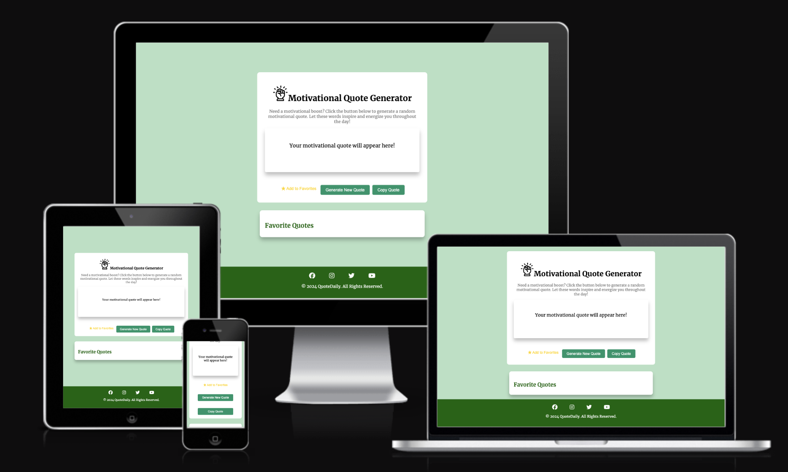
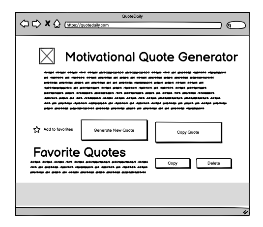

# QuoteDaily Website
[View the live project here](https://bilalessafi1.github.io/motivational-quote-generator/)

The QuoteDaily website is a simple and intuitive web application that provides users with inspiring and uplifting quotes at the click of a button. Whether you're looking for daily motivation, positivity, or just a little encouragement, this tool is designed to brighten your day with carefully selected quotes. 

## User Experience
### Project Goals
The primary goal of the Quote Daily website is to offer users a seamless way to access motivational quotes quickly and easily. Whether a user needs a quick boost or is looking to share a quote with friends, the interface is designed to be fast, clean, and engaging.

### Target Audience
- People seeking daily inspiration who want an easy to access motivational quotes.
- General users interested in uplifting content to improve their mindset. 

### User Stories
#### First-Time Visitor Goals:
- As a first-time visitor, I want to easily understand the purpose of the app and how to generate quotes. 
- As a first-time visitor, I want to be able to generate a new quote and copy the ones I like with minimal interaction, so I can efficiently share inspirational quotes without unnecessary steps.

#### Returning Visitor Goals:
- As a returning visitor, I want to see new motivational quotes that I haven't encountered before and copy the ones I like, so I can share inpirational quotes wihtout unnecessary steps. 

# Wireframes
The initial design of the website for mobile, tablet and desktop was created using Balsamiq, a tool specifically designed for creating wireframes.

## Wireframe Desktop

## Wireframe Tablet

## Wireframe Mobile

# Design
## Color Scheme
The color palatte consists of soft and uplifting green colors such as pastel and darkgreen. The colors evoke positivity and calm, aligning with the goal of providing a positive and motivational user experience. 

## Typography
The website uses a combination of serif and cursive fonts to create a balance between readibility and creativity. For the main text, the serif font Merriweather is uses, known for its classic, formal appearance and excellent readibility. In contrast, a cursive font is used for the author's name, adding a personal creative touch.

## Imagery
Only the logo image was added to the box to maintain the focus on the quotes.

# Features
## Quote Generator
- Random Quotes: A button generates a new random motivational quote from a curated libary. 
- Dynamic UI: The interface updates seamlessly without reloading the page, ensuring a smooth user experience. 

## Shareable Content
A simple "Copy Quote! button allows users to easily copy the quote to share it elsewhere.

## Footer
The footer includes social media icons for Facebook, Instagram, Twitter, and YouTube. These icons link to their respective social media platforms and open in a new tab. 

# Technologies Used
## Languages
- HTML: For structuring the app and ensuring all elements are in place.
- CSS: For styling the app and ensuring a visually appealing, responsive design. 
- JavaScript: For generating random quotes and enabling the possibility of copying elements to share elsewhere. 

# Frameworks, Libraries, Programs Used
## Google Fonts
- The font [Merriweather](https://fonts.google.com/specimen/Merriweather) was imported from [Google Fonts](https://fonts.google.com/). 

## Font Awesome
- [Font Awesome](https://fontawesome.com/) was used to add social media icons to the footer of all website pages.

## Balsamiq
- [Balsamiq](https://balsamiq.com/) was used to create wireframes.

## GitPOd
- [GitPod](https://www.gitpod.io/) was used to write the code for this websitem and to commit and push the code to Github.

## GitHub
- [GitHub](https://github.com/) was used to store this website.

## GitPages
- [GitPages](https://pages.github.com/) was used to deploy the website.

# Validator Testing

- HTML
    - No errors were returned when passing the code through the official W3C validatory [(see screenshot here)](validation.md)

- CSS
    - No errors were returned when passing the code through the official Jigsaw validator [(see screenshot here)](validation.md)

- JavaScript
    - No significant issues were returned when passing the code through Jshint [(see screenshot here)](validation.md)
- Accessibility
    - I confirmed that the colors and fonts chosen are easy to read and accessible by running it through lighthouse in devtools.
    

# Deployment

 The site was developed using [GitPod](https://www.gitpod.io/) and pushed to GitHub through a GitPod terminal. To deploy this site, GitHub Pages was used. The steps for deployment are as follows:

- Log in to Github.
- Locate and click on the right GitHub repository.
- At the top of the repository, locate and click on Settings.
- Navigate to the Pages section.
- Under Source click the drop-down menu und select Main.
- Click on Save.
- The page will automatically refresh, and you will receive a link to the deployed website.
- How to Fork this project:

Log in to GitHub.

Go to the repository for this project: https://github.com/BilalEssafi1/project1-morocco-guide.

Click on the Fork button on the right hand corner.

Select "Create a new fork".

How to Clone this project:

Log in to GitHub.

Go to the repository for this project: https://github.com/BilalEssafi1/project1-morocco-guide.

Click the green Code button.

Under the "Clone" section, you will see the repository URL. You can choose between HTTPS, SSH, or GitHub CLI.

Click the clipboard icon next to the URL to copy the link.

Open the terminal in your code editor and change the working directory using the cd command to the location where you want to clone the repository.

Run the git clone command followed by the repository URL you copied, and press Enter.