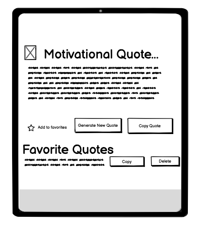
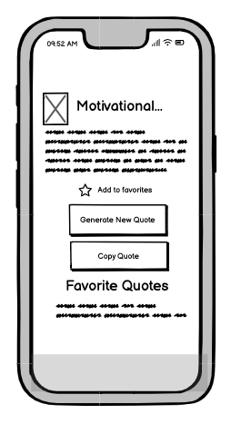
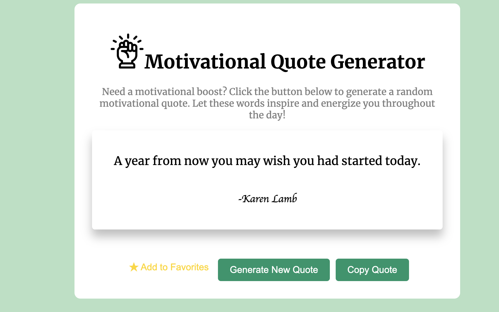

# QuoteDaily Website
[View the live project here](https://bilalessafi1.github.io/motivational-quote-generator/)

The QuoteDaily website is a simple and intuitive web application that provides users with inspiring and uplifting quotes at the click of a button. Whether you're looking for daily motivation, positivity, or just a little encouragement, this tool is designed to brighten your day with carefully selected quotes. 

## User Experience
### Project Goals
The primary goal of the Quote Daily website is to offer users a seamless way to access motivational quotes quickly and easily. Whether a user needs a quick boost or is looking to share a quote with friends, the interface is designed to be fast, clean, and engaging.

### Target Audience
- People seeking daily inspiration who want an easy to access motivational quotes.
- General users interested in uplifting content to improve their mindset. 

### User Stories
#### First-Time Visitor Goals:
- As a first-time visitor, I want to easily understand the purpose of the app and how to generate quotes. 
- As a first-time visitor, I want to be able to generate a new quote and copy the ones I like with minimal interaction, so I can efficiently share inspirational quotes without unnecessary steps.

#### Returning Visitor Goals:
- As a returning visitor, I want to see new motivational quotes that I haven't encountered before and copy the ones I like, so I can share inpirational quotes wihtout unnecessary steps. 

# Wireframes
The initial design of the website for mobile, tablet and desktop was created using Balsamiq, a tool specifically designed for creating wireframes.

## Wireframe Desktop

## Wireframe Tablet

## Wireframe Mobile

# Design
## Color Scheme
The color palatte consists of soft and uplifting green colors such as pastel and darkgreen. The colors evoke positivity and calm, aligning with the goal of providing a positive and motivational user experience. 

## Typography
The website uses a combination of serif and cursive fonts to create a balance between readibility and creativity. For the main text, the serif font Merriweather is uses, known for its classic, formal appearance and excellent readibility. In contrast, a cursive font is used for the author's name, adding a personal creative touch.

## Imagery
Only the logo image was added to the box to maintain the focus on the quotes.

# Features
## Quote Generator
- Random Quotes: A button generates a new random motivational quote from a curated libary. 
- Dynamic UI: The interface updates seamlessly without reloading the page, ensuring a smooth user experience. 

## Shareable Content
- Copy to Clipboard: A simple button allows users to easily copy the quote to share it elsewhere.

## Footer
